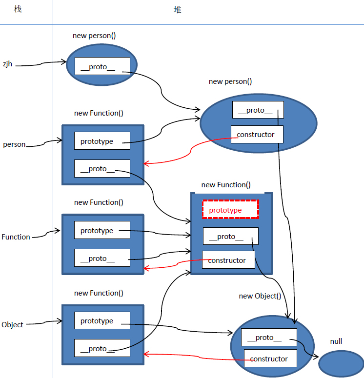

# JavaScript 原型链

## 对象

JavaScript 中的对象分为普通对象和函数对象，

-   函数对象

    凡是通过 new Function() 创建的对象都是函数对象，其他的都是普通对象。

    js 自带函数对象比如：

    ```
    Array, Boolean, Date, Math, Number, String, RegExp, Function, Object
    ```

    函数对象都有一个属性：原型对象 prototype

-   普通对象

    普通对象没有 prototype ，但有 `__proto__` 属性

## 原型链




-   原型对象（prototype）

    原型对象其实就是普通对象（ Function.prototype 除外，Function.prototype 是函数对象，但是它没有 prototype 属性）

    实际上，f.prototype 就是 f 的一个实例对象。值 f 创建的时候，创建了一个它的实例对象并赋值给它的 prototype ，类似这样：

    ```javascript
    var tmp = new f()
    f.prototype = tmp
    ```

-   原型（__proto__）

    对象的 `__proto__` 属性指向创建它的函数对象的原型对象 prototype

    特殊：

    ```javascript
    Object.prototype.__proto__  === null
    Function.prototype.__proto__ === Object.prototype
    Function.__proto__ === Function.prototype
    ```

-   constructor

    原型对象 prototype 中都有个预定义点 constructor 属性，用来引用它的函数对象。

## 参考资料

* [JS原型与原型链终极详解](http://www.108js.com/article/article1/10201.html)
* [深入理解javascript原型和闭包](http://www.kancloud.cn/kancloud/javascript-prototype-closure/66341)

