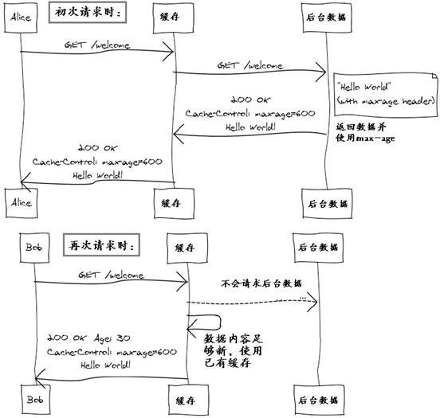

# 概念

-   [REST（Representational State Transfer）](http://www.ics.uci.edu/~fielding/pubs/dissertation/rest_arch_style.htm)

    REST 是一种软件架构风格，设计风格而不是标准，只是提供了一组设计原则和约束条件。它主要用于客户端和服务器交互类的软件。基于这个风格设计的软件可以更简洁，更有层次，更易于实现缓存等机制。

-   资源（Resources）

    REST的名称"表现层状态转化"中，省略了主语。"表现层"其实指的是"资源"的"表现层"。

    "资源"，就是网络上的一个实体，它可以是一段文本、一张图片、一首歌曲、一种服务，可以用一个URI（统一资源定位符）指向它，每种资源对应一个特定的URI。

-   表现层（Representation）

    "资源"是一种信息实体，它可以有多种外在表现形式。我们把"资源"具体呈现出来的形式，叫做它的"表现层"

    比如，文本可以用txt格式表现，也可以用HTML格式、XML格式、JSON格式表现，甚至可以采用二进制格式；图片可以用JPG格式表现，也可以用PNG格式表现。

    URI只代表资源的实体，不代表它的形式。严格地说，有些网址最后的".html"后缀名是不必要的，因为这个后缀名表示格式，属于"表现层"范畴，而URI应该只代表"资源"的位置。

-   状态转化（State Transfer）

    如果客户端想要操作服务器，必须通过某种手段，让服务器端发生"状态转化"（State Transfer）。而这种转化是建立在表现层之上的，所以就是"表现层状态转化"。

# 动词

五个非常重要的 HTTP 动词：

```
GET     （选择）：从服务器上获取一个具体的资源或者一个资源列表。
POST    （创建）：在服务器上创建一个新的资源。
PUT     （更新）：以整体的方式更新服务器上的一个资源。
PATCH   （补丁）：只更新服务器上一个资源的一个属性。
DELETE  （删除）：删除服务器上的一个资源。
```

两个不常用的 HTTP 动词：

```
HEAD        获取一个资源的元数据，如数据的哈希值或最后的更新时间。
OPTIONS     获取客户端能对资源做什么操作的信息。
```

# 版本化

一个好的 RESTful API 会在 URL 中包含版本信息。

另一种比较常见的方案是在请求头里面保持版本信息。

# 端点（Endpoints）

指向特定资源或资源集合的 URL ：

```
GET     /zoos                   List all Zoos (ID and Name, not too much detail)
POST    /zoos                   Create a new Zoo
GET     /zoos/ZID               Retrieve an entire Zoo object
PUT     /zoos/ZID               Update a Zoo (entire object)
PATCH   /zoos/ZID               Update a Zoo (partial object)
DELETE  /zoos/ZID               Delete a Zoo
POST    /animals                Create a new Animal
GET     /animals                List all Animals (ID and Name).
GET     /zoos/ZID/animals       Retrieve a listing of Animals (ID and Name).
```

# 内容协商

根据应用场景，针对相同的资源，可能会期待不同的返回形式。使用 Accept 头进行内容协商：

```
Accept                  设置我们接受的返回结果的内容格式，如： application/json
Accept-Charset          设置字符集
Accept-Encoding         设置数据传输格式
Accept-Language         设置语言
```

# 过滤器

让客户端自己对结果做一些具体的过滤或限制，可以实现分页等：

```
limit       限制返回数量（用于分页）。
offset      偏移(跳过)数量（用于分页）。
type        使用条件匹配来过滤记录。
sort        排序字段。
order       对结果按特定属性进行排序。
```

# 状态码

这里有大量的 HTTP 状态码可以选择：

* [10 Status Code Definitions](https://www.w3.org/Protocols/rfc2616/rfc2616-sec10.html)
* [status](https://github.com/jshttp/statuses/blob/master/codes.json)
* [http 错误代码表](http://www.cnblogs.com/kunhony/archive/2006/06/16/427305.html)
* [选择一个 HTTP 状态码不再是一件难事 – Racksburg](http://www.zcfy.cc/article/choosing-an-http-status-code-stop-making-it-hard-8211-racksburg-904.html)

下面的列表只给出了一些重要的代码作为一个参考：

```
200 OK – [GET]                                客户端向服务器请求数据，服务器成功找到它们
201 CREATED – [POST/PUT/PATCH]                客户端向服务器提供数据，服务器根据要求创建了一个资源
204 NO CONTENT – [DELETE]                     客户端要求服务器删除一个资源，服务器删除成功
400 INVALID REQUEST – [POST/PUT/PATCH]        客户端向服务器提供了不正确的数据，服务器什么也没做
404 NOT FOUND – [*]                           客户端引用了一个不存在的资源或集合，服务器什么也没做
500 INTERNAL SERVER ERROR – [*]               服务器发生内部错误，客户端无法得知结果，即便请求已经处理成功
```

状态码范围：

```
1xx 范围的状态码是保留给底层HTTP功能使用的，并且估计在你的职业生涯里面也用不着手动发送这样一个状态码出来。
2xx 范围的状态码是保留给成功消息使用的，你尽可能的确保服务器总发送这些状态码给用户。
3xx 范围的状态码是保留给重定向用的。大多数的API不会太常使用这类状态码，但是在新的超媒体样式的API中会使用更多一些。
4xx 范围的状态码是保留给客户端错误用的。例如，客户端提供了一些错误的数据或请求了不存在的内容。这些请求应该是幂等的，不会改变任何服务器的状态。
5xx 范围的状态码是保留给服务器端错误用的。这些错误常常是从底层的函数抛出来的，并且开发人员也通常没法处理。发送这类状态码的目的是确保客户端能得到一些响应。收到5xx响应后，客户端没办法知道服务器端的状态，所以这类状态码是要尽可能的避免。
```

# 预期的返回文档

当使用不同的 HTTP 动词向服务器请求时，客户端需要在返回结果里面拿到一系列的信息。下面的列表是非常经典的 RESTful API 定义：

```
GET     /collection                 返回一系列资源对象
GET     /collection/resource        返回单独的资源对象
POST    /collection                 返回新创建的资源对象
PUT     /collection/resource        返回完整的资源对象
PATCH   /collection/resource        返回完整的资源对象
DELETE  /collection/resource        返回一个空文档
```

返回数据结构：

```js
{
  "status": {
    "code": 0,
    "message": "success"
  },
  "data": {
    "_id": "57aaedd80bd0a0958695f4ef",
    "openid": "ooVSouJAFXv8_1kurXRqeoKd-cEY",
    "unionid": "oRWRTwzuOKZT1AiLD6O02To9qPc8",
    "nickname": "M.",
    "headimgurl": "http://wx.qlogo.cn/mmopen/0PjnyGUGRrNpNIVRDMnqHFflGuia42NOVWYEtKUceOebGHtu7iacLmDpFfMzcKcDAibgctzsD6zDfQVSMPl8URxKf7icqvovUKwz/0"
  }
}
```

数据说明：

* status             请求处理状态
* status.code        状态码，0 表示成功，非 0 表示各种不同的错误。 参考 [微信公众平台开发者文档-全局返回码说明](http://mp.weixin.qq.com/wiki/10/6380dc743053a91c544ffd2b7c959166.html)
* status.message     描述信息，成功时为"success"，错误时则是错误信息
* data               成功时返回的数据

# 缓存处理

HTTP 头中，有多个字段可以用于缓存处理。比较常用的有缓存控制和条件请求。

-   缓存控制

    缓存控制通常是需要客户端，缓存服务器 / 代理服务器与业务服务器一起发生作用。

    HTTP 头中有“Cache-control”字段来控制如何使用缓存，常见的取值有 private、no-cache、max-age、must-revalidate 等。比如当你给返回的数据内容设置 max-age=600，那么当用户隔了 30 秒再次请求的时候，就不会导致重新请求后台数据。

    另外，也可以通过“Expires”字段来指定内容过期时间，在此时间前的请求都不会导致后台程序重新请求数据。

    下图展示了 max-age 是如何工作的：

    

-   条件请求与电子标签：

    很多时候，数据内容可能会几个小时甚至几天都不会发生变动，这个时候根据请求时间间隔来控制缓存，就不能满足系统的需求了。通过支持条件请求与电子标签，可以帮助我们来解决这个问题。

    当用户请求数据内容时，系统在返回数据的同时，在 HTTP 头中，将返回根据服务器内容的最后修改时间 Last-Modified，或者根据服务器内容生成电子标签 ETag。 当用户再次请求数据时，就可以在 HTTP 请求中使用 If-Modified-Since 或者 If-None-Match 头信息，把上次请求得到的时间戳或者电子标签传给服务器。当收到一个有条件请求的 HTTP 头的 REST 请求的时候，我们的程序需要将收到的时间戳或者电子标签与当前内容作比较，就可以很容易的知道用户请求的数据内容在这段时间是否发生过修改，并根据比较结果返回给用户最新内容，或者用 HTTP 响应码 304 告知用户，内容没有变化。

# 认证

RESTFul最重要的一个设计原则就是，客户端与服务器的交互在请求之间是无状态的，也就是说，当涉及到用户状态时，每次请求都要带上身份验证信息。实现上，大部分都采用 JSON Web Token 的认证方式，一般流程是：

```
1. 用户用密码登录成功后，服务器返回token给客户端；
2. 客户端将token保存在本地，发起后续的相关请求时，将token发回给服务器；
3. 服务器检查token的有效性，有效则返回数据，若无效，分两种情况：
   (1) token错误，这时需要用户重新登录，获取正确的token
   (2) token过期，这时客户端需要再发起一次认证请求，获取新的token
```

然而，此种验证方式存在一个安全性问题：当登录接口被劫持时，黑客就获取到了用户密码和token。优化方案：

1.  采用HTTPS。

    HTTPS在HTTP的基础上添加了SSL安全协议，自动对数据进行了压缩加密，在一定程序可以防止监听、防止劫持、防止重发，安全性可以提高很多。不过，SSL也不是绝对安全的，也存在被劫持的可能。另外，服务器对HTTPS的配置相对有点复杂，还需要到CA申请证书，而且一般还是收费的。而且，HTTPS效率也比较低。一般，只有安全要求比较高的系统才会采用HTTPS，比如银行。而大部分对安全要求没那么高的App还是采用HTTP的方式。

2.  添加签名。

    给客户端分配一个密钥，每次请求接口时，将密钥和所有参数组合成源串，根据签名算法生成签名值，发送请求时将签名一起发送给服务器验证。类似的实现可参考OAuth1.0的签名算法。这样，黑客不知道密钥，不知道签名算法，就算拦截到登录接口，后续请求也无法成功操作。不过，因为签名算法比较麻烦，而且容易出错，只适合对内的接口。如果你们的接口属于开放的API，则不太适合这种签名认证的方式了，建议还是使用OAuth2.0的认证机制。

    我们也可以给每个端分配一个appKey，比如Android、iOS、微信三端，每个端分别分配一个appKey和一个密钥。没有传appKey的请求将报错，传错了appKey的请求也将报错。这样，安全性方面又加多了一层防御，同时也方便对不同端做一些不同的处理策略。

# 最佳实践

* [GitHub API v3 | GitHub Developer Guide](https://developer.github.com/v3/)
* [微博API](http://open.weibo.com/wiki/%E5%BE%AE%E5%8D%9AAPI)

# 参考资料

* [理解RESTful架构](http://www.ruanyifeng.com/blog/2011/09/restful)
* [RESTful API的设计与开发](http://files.cnblogs.com/files/moonz-wu/RESTful_API%E4%BB%8B%E7%BB%8D.pdf)
* [好RESTful API的设计原则](http://www.cnblogs.com/moonz-wu/p/4211626.html?hmsr=toutiao.io&utm_medium=toutiao.io&utm_source=toutiao.io)
* [App架构设计经验谈:接口的设计](http://keeganlee.me/post/architecture/20160107?hmsr=toutiao.io&utm_medium=toutiao.io&utm_source=toutiao.io)
* [基于 REST 的 Web 服务：基础](http://www.ibm.com/developerworks/cn/webservices/ws-restful/)
* [最佳实践：更好的设计你的 REST API](http://www.ibm.com/developerworks/cn/web/1103_chenyan_restapi/?hmsr=toutiao.io&utm_medium=toutiao.io&utm_source=toutiao.io)

# 更多相关文章

* [一个工作中用得到的RESTful API规范](http://webfuse.cn/2016/05/17/一个工作中用得到的RESTful%20API规范/)
* [RESTful最佳实践](http://arccode.net/2015/02/26/RESTful最佳实践/)
* [RESTful API 设计最佳实践](http://www.csdn.net/article/2013-06-13/2815744-RESTful-API)
* [说说JSON和JSONP，也许你会豁然开朗，含jQuery用例](http://www.cnblogs.com/dowinning/archive/2012/04/19/json-jsonp-jquery.html)

