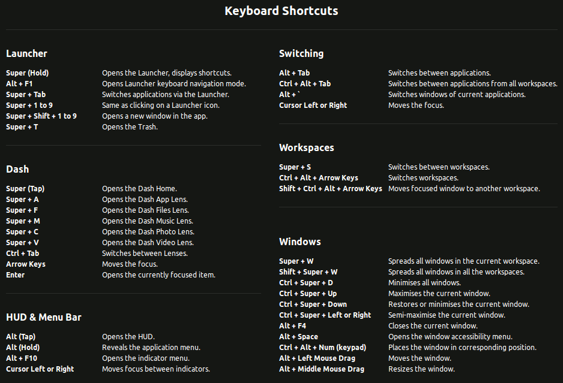
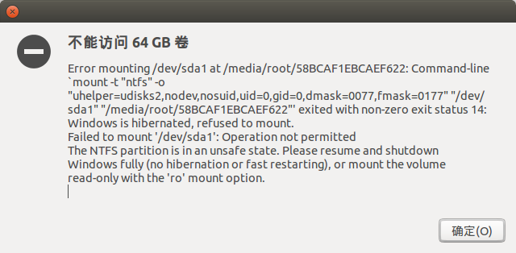
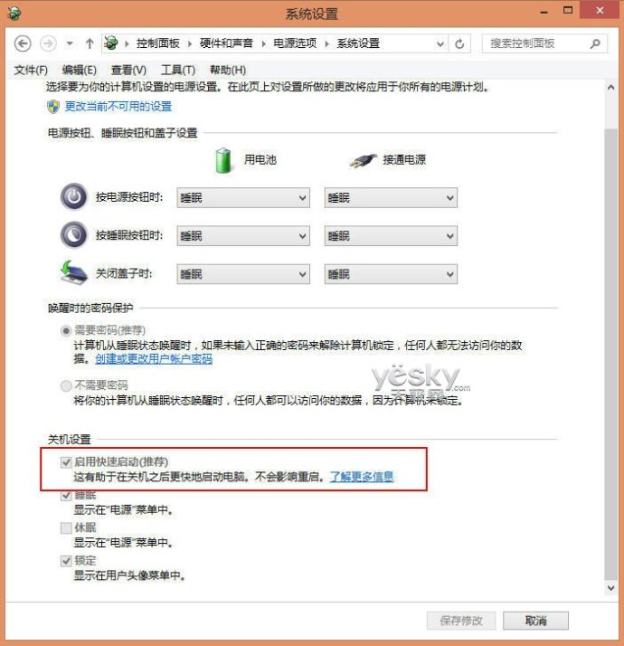

# Ubuntu 下开发常见遇到的问题以及解决方案

## 快捷键



## 卸载不常用的软件

-   删除libreoffice

    `sudo apt-get remove libreoffice-common`

-   删除Amazon的链接

    `sudo apt-get remove unity-webapps-common`

-   删掉基本不用的自带软件

    ```
    sudo apt-get remove thunderbird totem rhythmbox empathy brasero simple-scan gnome-mahjongg aisleriot gnome-mines cheese transmission-common gnome-orca webbrowser-app gnome-sudoku landscape-client-ui-install onboard deja-dup
    ```

-   卸载火狐浏览器

    ```bash
    # 查询相关
    dpkg --get-selections | grep firefox

    # 完全卸载
    sudo apt-get purge firefox firefox-branding firefox-gnome-support ubufox firefox-locale-en unity-scope-firefoxbookmarks
    ```

## vi 编辑器上下左右键变成ABCD

-   解决办法

    可以在终端中输入如下命令：

    ```
    export TERM=linux
    ```

## 配置apt-get 源

-   编辑：

    `vi /etc/apt/sources.list`

-   增加国内源：

    ```
    # 搜狐源：
    deb http://mirrors.sohu.com/ubuntu/ precise-updates main restricted
    deb-src http://mirrors.sohu.com/ubuntu/ precise-updates main restricted
    deb http://mirrors.sohu.com/ubuntu/ precise universe
    deb-src http://mirrors.sohu.com/ubuntu/ precise universe
    deb http://mirrors.sohu.com/ubuntu/ precise-updates universe
    deb-src http://mirrors.sohu.com/ubuntu/ precise-updates universe
    deb http://mirrors.sohu.com/ubuntu/ precise multiverse
    deb-src http://mirrors.sohu.com/ubuntu/ precise multiverse
    deb http://mirrors.sohu.com/ubuntu/ precise-updates multiverse
    deb-src http://mirrors.sohu.com/ubuntu/ precise-updates multiverse
    deb http://mirrors.sohu.com/ubuntu/ precise-backports main restricted universe multiverse
    deb-src http://mirrors.sohu.com/ubuntu/ precise-backports main restricted universe multiverse

    # 网易源：
    deb http://mirrors.163.com/ubuntu/ precise-updates main restricted
    deb-src http://mirrors.163.com/ubuntu/ precise-updates main restricted
    deb http://mirrors.163.com/ubuntu/ precise universe
    deb-src http://mirrors.163.com/ubuntu/ precise universe
    deb http://mirrors.163.com/ubuntu/ precise-updates universe
    deb-src http://mirrors.163.com/ubuntu/ precise-updates universe
    deb http://mirrors.163.com/ubuntu/ precise multiverse
    deb-src http://mirrors.163.com/ubuntu/ precise multiverse
    deb http://mirrors.163.com/ubuntu/ precise-updates multiverse
    deb-src http://mirrors.163.com/ubuntu/ precise-updates multiverse
    deb http://mirrors.163.com/ubuntu/ precise-backports main restricted universe multiverse
    deb-src http://mirrors.163.com/ubuntu/ precise-backports main restricted universe multiverse
    ```

## 不能识别移动硬盘

-   安装：

    `sudo apt-get install cifs-utils`

## sublime 无法输入中文

-   安装搜狗输入法

    官网下载 deb 包

    <http://pinyin.sogou.com/linux/>

    配置

    打开 Fcitx configuration ， 选择 '+' ，把 Only show current language 取消勾选，搜索 pinyin 添加进来

-   下载需要的文件

    ```
    git clone https://github.com/lyfeyaj/sublime-text-imfix.git
    ```

-   将 subl 移动到/usr/bin/，将 sublime-imfix.so 移动到/opt/sublime_text/

    ```
    cd ~/sublime-text-imfix
    sudo cp ./lib/libsublime-imfix.so /opt/sublime_text/
    sudo cp ./src/subl /usr/bin/
    ```

-   用 subl 命令启动sublime

-   详细

    <http://www.jianshu.com/p/bf05fb3a4709>

## 双显卡设备出现未知显示器

-   详细：

    <http://www.kaijia.me/2014/04/ubuntu-14-04-unknown-display-in-dual-graphics-solved/>

-   原因：

    官方对这个错误的解释是双显卡驱动的情况下（比如Kaijia的笔记本是就是集显和N卡热切换）Ubuntu会同时读出两个显示器，显示的效果即为一个内置显示器和一个未知显示器。

-   解决：

    `sudo apt-get install bumblebee-nvidia`

## 解决 ssh 登录慢的解决办法

-   描述：

    在ubuntu下ssh登陆某些服务器,会发生需要等到十来秒才提示输入密码下现象,其实这个是debian做的一个配置上的修改引起的.

    ssh_config(5) 的man页上有这样的说明:

    ```
    Note that the Debian openssh-client package sets several options as stan-
    dard in /etc/ssh/ssh_config which are not the default in ssh(1):
        o SendEnv LANG LC_*
        o HashKnownHosts yes
        o GSSAPIAuthentication yes
    ```

    这个问题正是最后面那项 GSSAPIAuthentication 引起的,打开这个ssh的时候可能会先去尝试其他的认证方式.
    很多地方都会介绍说修改 /etc/ssh/ssh_config 文件,但是其实这并不是最好的办法,因为在下次升级的时候,
    也许会因为配置文件被修改过,而引起不必要的麻烦.

-   解决办法：

    我的解决办法是修改个人用户的配置文件,如下:

    ```
    echo "GSSAPIAuthentication no" >> ~/.ssh/config
    ```

-   详细

    <http://blog.sina.com.cn/s/blog_4d19911d0100ym25.html>

## 禁用错误提示.

-   查看错误提示文件

    `$ ls /var/crash/`

-   禁用错误提示“System Program problem detected”

    编辑apport文件 `/etc/default/apport`

    找到 enabled=1 这一行，并改变到0(zero)

    ```
    # set this to 0 to disable apport, or to 1 to enable it
    # you can temporarily override this with
    # sudo service apport start force_start=1
    enabled=0
    ```

    保存，退出。停止apport服务：

    `$ sudo stop apport`

## 解压 rar 文件

-   安装

    `sudo apt-get install rar`

    `sudo apt-get install unrar`

## 解压 zip 文件中文乱码

-   通过 unzip 命令解压，指定字符集

    `unzip -O CP936 xxx.zip`  (用GBK, GB18030也可以)

    unzip 的 manual 中并无这个选项的说明, unzip --help对这个参数有一行简单的说明。

-   写入环境变量

    `alias unzip="unzip -O CP936"`

## win 双系统：时间不对

-   原理

    装了双系统windows+ubuntu的童鞋可能会遇到这种情况，就是在windows下的时间老是不对，即使你
    调整好，当你登陆过ubuntu后，再重新登陆windows后，时间又会变得不对了，细心地朋友会发现这其
    中恰好差了8个小时！

    这主要是因为安装ubuntu时选择了UTC时间，就是ubuntu一开机总是从Internet获取时间，写入Bios，
    然后在这个时间的基础上+8（根据当时选择的时区东八区），就是此时系统中的显示的时间。

    但是win7就悲剧了，它总是从Bios中读取时间，而这个时间是ubuntu写入的UTC时间，它不会加8个小时。
    所以就出现了这样的情况。

-   解决办法

    1.`sudo gedit /etc/default/rcS` ，utc=yes 改成utc=no

    2.将时间写入BIOS： `sudo hwclock --systohc`

## win 双系统：直接进入 Ubuntu

-   执行以下命令，然后重启

    `$ sudo update-grub`

## win 双系统：不能挂载 ntfs 磁盘



-   原理

    Win8默认开启了快速启动功能，即“混合启动”。简单说，“混合启动”的原理是关机的时候只关闭用户会话，
    让系统内核会话转入休眠状态，从而有效提高Win8系统的启动速度。这也是win8关闭和启动都很快，重启
    很慢的原因。而这种休眠状态下的磁盘Ubuntu认为处于一种不安全的状态，所以拒绝挂载。因此我们可以
    选择先进入Win8系统，然后重启，并进入Ubuntu的系统，即可以自动挂载。

    当然，每次选择进入WIn8再重启的方式肯定让人无法接受，那么可以选择关闭Win8的快速启动功能，就
    可以彻底解决这个问题。

-   方法

    进入控制面板，依次打开“控制面板—系统和安全—电源选项—选择电源按钮的功能”。如下图设置：

    

    首先点击上部分的“更改当前不可用的设置”，然后去掉“启用快速启动（推荐）”前面的勾即可。这个时候
    再选择win8关机后，就是完全关机了。

    注意：即使去掉了快速启动，如果Win8非正常关机，也可能会引起上面的挂载磁盘失败的问题，这时候可以
    选择正常启动Win8，然后再关机即可。

    参考资料： <http://blog.sina.com.cn/s/blog_5c9a54e30101v3zo.html>

-   另外一种方法：

    1、打开终端：如果没有安装ntfs-3g就要安装：sudo apt-get install ntfs-3g

    2、修复挂载错误的相应的分区，例如提示中的/dev/sda8，输入： `sudo ntfsfix /dev/sda8`

    参考资料： <http://ask.csdn.net/questions/188940>

## win 双系统：Windows 耳机没声音

-   解决方法

    在 windows 系统中点击休眠，再重新唤醒就可以了

    最简单的合上笔记本盖子再重新打开。。。
