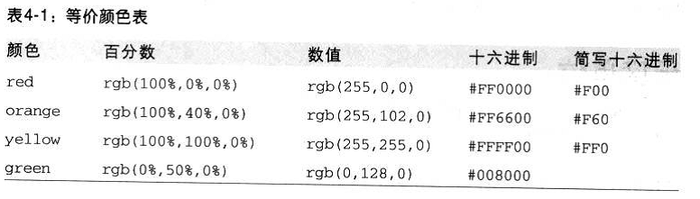
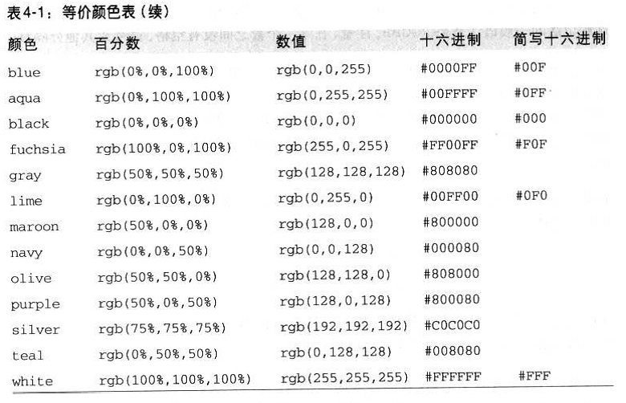
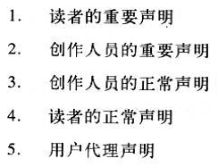
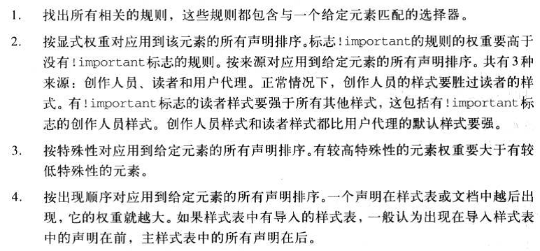

目录

*   [基础](#%E5%9F%BA%E7%A1%80)
    * [选择器](#%E9%80%89%E6%8B%A9%E5%99%A8)
    * [规范](#%E8%A7%84%E8%8C%83)
*   [基本属性](#%E5%9F%BA%E6%9C%AC%E5%B1%9E%E6%80%A7)
    * [尺寸](#%E5%B0%BA%E5%AF%B8)
    * [背景](#%E8%83%8C%E6%99%AF)
    * [字体](#%E5%AD%97%E4%BD%93)
    * [文本](#%E6%96%87%E6%9C%AC)
    * [列表](#%E5%88%97%E8%A1%A8)
    * [边框和轮廓](#%E8%BE%B9%E6%A1%86%E5%92%8C%E8%BD%AE%E5%BB%93)
    * [外边距和填充](#%E5%A4%96%E8%BE%B9%E8%B7%9D%E5%92%8C%E5%A1%AB%E5%85%85)
    * [浮动和定位](#%E6%B5%AE%E5%8A%A8%E5%92%8C%E5%AE%9A%E4%BD%8D)
    * [显示和可见性](#%E6%98%BE%E7%A4%BA%E5%92%8C%E5%8F%AF%E8%A7%81%E6%80%A7)
    * [伪类和伪元素](#%E4%BC%AA%E7%B1%BB%E5%92%8C%E4%BC%AA%E5%85%83%E7%B4%A0)
*   [值和单位](#%E5%80%BC%E5%92%8C%E5%8D%95%E4%BD%8D)
    * [字体](#%E5%AD%97%E4%BD%93-1)
    * [颜色](#%E9%A2%9C%E8%89%B2)
    * [长度单位](#%E9%95%BF%E5%BA%A6%E5%8D%95%E4%BD%8D)
*   [特殊性、继承、层叠](#%E7%89%B9%E6%AE%8A%E6%80%A7%E7%BB%A7%E6%89%BF%E5%B1%82%E5%8F%A0)
    * [特殊性](#%E7%89%B9%E6%AE%8A%E6%80%A7)
    * [继承](#%E7%BB%A7%E6%89%BF)
    * [层叠](#%E5%B1%82%E5%8F%A0)
*   [常用实例](#%E5%B8%B8%E7%94%A8%E5%AE%9E%E4%BE%8B)
    * [Reset CSS](#reset-css)
    * [方形头像变圆](#%E6%96%B9%E5%BD%A2%E5%A4%B4%E5%83%8F%E5%8F%98%E5%9C%86)
    * [禁止选中内容](#%E7%A6%81%E6%AD%A2%E9%80%89%E4%B8%AD%E5%86%85%E5%AE%B9)
    * [禁止保存或拷贝图像](#%E7%A6%81%E6%AD%A2%E4%BF%9D%E5%AD%98%E6%88%96%E6%8B%B7%E8%B4%9D%E5%9B%BE%E5%83%8F)
    * [解决边框重叠变粗](#%E8%A7%A3%E5%86%B3%E8%BE%B9%E6%A1%86%E9%87%8D%E5%8F%A0%E5%8F%98%E7%B2%97)
    * [生成 1px 边框效果](#%E7%94%9F%E6%88%90-1px-%E8%BE%B9%E6%A1%86%E6%95%88%E6%9E%9C)
    * [文本太长时省略处理](#%E6%96%87%E6%9C%AC%E5%A4%AA%E9%95%BF%E6%97%B6%E7%9C%81%E7%95%A5%E5%A4%84%E7%90%86)
    * [元素居中](#%E5%85%83%E7%B4%A0%E5%B1%85%E4%B8%AD)
    * [导航栏上的下拉菜单](#%E5%AF%BC%E8%88%AA%E6%A0%8F%E4%B8%8A%E7%9A%84%E4%B8%8B%E6%8B%89%E8%8F%9C%E5%8D%95)
    * [使用下边框替代链接下划线](#%E4%BD%BF%E7%94%A8%E4%B8%8B%E8%BE%B9%E6%A1%86%E6%9B%BF%E4%BB%A3%E9%93%BE%E6%8E%A5%E4%B8%8B%E5%88%92%E7%BA%BF)

# 基础

## 选择器

* 所有元素： *
* ID选择器： #id
* 类选择器： .class
* 元素选择符
  * element 指定元素
  * element,element 并列
  * element element 后代
  * element>element 父子
  * element~element 兄弟
  * element+element 相邻
* 属性选择器
  * [attribute] 带有属性
  * [attribute=value]  属性值等于 value
  * [attribute~=value] 属性值包含 value
  * [attribute|=value] 属性值等于 value 或以 value- 开头
  * [attribute^=value] 属性值以 value 字符串开头
  * [attribute$=value] 属性值以 value 字符串结尾
  * [attribute*=value] 属性值包含 value 字符串
* 伪元素和伪类
  * 伪类的顺序很重要，通常的建议是： `link-visited-focus-hover-active`
    * :link
    * :visited
    * :focus
    * :hover
    * :active
  * -
    * :root
    * :first-letter
    * :first-line
    * :before
    * :after
  * -
    * :first-of-type
    * :last-of-type
    * :only-of-type
    * :nth-of-type(n)
    * :nth-last-of-type(n)
  * -
    * :first-child
    * :last-child
    * :only-child
    * :nth-child(n)
    * :nth-last-child(n)
  * -
    * :empty
    * :target
    * :enabled
    * :disabled
    * :checked
    * :not(selector)
    * ::selection
    * :lang(language)

## 规范

*   文件命名规范

    ```
    全局样式：global.css
    框架布局：layout.css
    字体样式：font.css
    链接样式：link.css
    打印样式：print.css
    ```

*   常用类/ID命名规范

    ```
    页　眉：header
    内　容：content
    容　器：container
    页　脚：footer
    版　权：copyright　
    导　航：menu
    主导航：mainMenu
    子导航：subMenu
    标　志：logo
    标　语：banner
    标　题：title
    侧边栏：sidebar
    图　标：Icon
    注　释：note
    搜　索：search
    按　钮：btn
    登　录：login
    链　接：link
    信息框：manage
    ```

# 基本属性

## 尺寸

| 属性名称                         | 功能简介 |
|:--------------------------------|:--------|
| width                           |设置元素的宽度。
| max-width                       |设置元素的最大宽度。
| min-width                       |设置元素的最小宽度。
| height                          |设置元素的高度。
| max-height                      |设置元素的最大高度。
| min-height                      |设置元素的最小高度。

## 背景

| 属性名称                         | 功能简介 |
|:--------------------------------|:--------|
| background                      | 简写属性，作用是将背景属性设置在一个声明中。
| background-attachment           | 背景图像是否固定或者随着页面的其余部分滚动。
| background-color                | 设置元素的背景颜色。
| background-image                | 把图像设置为背景。
| background-position             | 设置背景图像的起始位置。
| background-repeat               | 设置背景图像是否及如何重复。

## 字体

| 属性名称                         | 功能简介 |
|:--------------------------------|:--------|
| font                            | 在一个声明中设置所有的字体属性
| font-family                     | 指定文本的字体系列
| font-size                       | 指定文本的字体大小
| font-style                      | 指定文本的字体样式
| font-variant                    | 以小型大写字体或者正常字体显示文本。
| font-weight                     | 指定字体的粗细。

## 文本

| 属性名称                         | 功能简介 |
|:--------------------------------|:--------|
| color                           | 设置文本颜色
| direction                       | 设置文本方向。
| letter-spacing                  | 设置字符间距
| line-height                     | 设置行高
| text-align                      | 对齐元素中的文本
| text-decoration                 | 向文本添加修饰
| text-indent                     | 缩进元素中文本的首行
| text-shadow                     | 设置文本阴影
| text-transform                  | 控制元素中的字母
| unicode-bidi                    | 设置或返回文本是否被重写
| vertical-align                  | 设置元素的垂直对齐
| white-space                     | 设置元素中空白的处理方式
| word-spacing                    | 设置字间距

## 列表

| 属性名称                         | 功能简介 |
|:--------------------------------|:--------|
| list-style                      | 简写属性。用于把所有用于列表的属性设置于一个声明中
| list-style-image                | 将图象设置为列表项标志。
| list-style-position             | 设置列表中列表项标志的位置。
| list-style-type                 | 设置列表项标志的类型。

## 边框和轮廓

| 属性名称                         | 功能简介 |
|:--------------------------------|:--------|
| outline                         | 简写属性，在一个声明中设置所有的外边框属性
| outline-color                   | 设置外边框的颜色
| outline-style                   | 设置外边框的样式
| outline-width                   | 设置外边框的宽度
| border                          | 简写属性，用于把针对四个边的属性设置在一个声明。
| border-color                    | 简写属性，设置元素的所有边框中可见部分的颜色，或为 4 个边分别设置颜色。
| border-style                    | 用于设置元素所有边框的样式，或者单独地为各边设置边框样式。
| border-width                    | 简写属性，用于为元素的所有边框设置宽度，或者单独地为各边边框设置宽度。
| border-top                      | 简写属性，用于把上边框的所有属性设置到一个声明中。
| border-top-color                | 设置元素的上边框的颜色。
| border-top-style                | 设置元素的上边框的样式。
| border-top-width                | 设置元素的上边框的宽度。
| border-right                    | 简写属性，用于把右边框的所有属性设置到一个声明中。
| border-right-color              | 设置元素的右边框的颜色。
| border-right-style              | 设置元素的右边框的样式。
| border-right-width              | 设置元素的右边框的宽度。
| border-bottom                   | 简写属性，用于把下边框的所有属性设置到一个声明中。
| border-bottom-color             | 设置元素的下边框的颜色。
| border-bottom-style             | 设置元素的下边框的样式。
| border-bottom-width             | 设置元素的下边框的宽度。
| border-left                     | 简写属性，用于把左边框的所有属性设置到一个声明中。
| border-left-color               | 设置元素的左边框的颜色。
| border-left-style               | 设置元素的左边框的样式。
| border-left-width               | 设置元素的左边框的宽度。

## 外边距和填充

| 属性名称                         | 功能简介 |
|:--------------------------------|:--------|
| margin                          | 简写属性。在一个声明中设置所有外边距属性。
| margin-top                      | 设置元素的上外边距。
| margin-right                    | 设置元素的右外边距。
| margin-bottom                   | 设置元素的下外边距。
| margin-left                     | 设置元素的左外边距。
| padding                         | 简写属性。在一个声明中的所有填充属性
| padding-top                     | 设置元素的顶部填充
| padding-right                   | 设置元素的右部填充
| padding-bottom                  | 设置元素的底部填充
| padding-left                    | 设置元素的左部填充

## 浮动和定位

| 属性名称                         | 功能简介 |
|:--------------------------------|:--------|
| clear                           | 指定不允许元素周围有浮动元素。
| float                           | 指定一个盒子（元素）是否可以浮动。
| position                        | 指定元素的定位类型
| top                             | 定义了一个定位元素的上外边距边界与其包含块上边界之间的偏移。
| right                           | 定义了定位元素右外边距边界与其包含块右边界之间的偏移。
| bottom                          | 定义了定位元素下外边距边界与其包含块下边界之间的偏移。
| left                            | 定义了定位元素左外边距边界与其包含块左边界之间的偏移。
| z-index                         | 设置元素的堆叠顺序
| overflow                        | 设置当元素的内容溢出其区域时发生的事情。
| cursor                          | 显示光标移动到指定的类型
| clip                            | 剪辑一个绝对定位的元素

## 显示和可见性

| 属性名称                         | 功能简介 |
|:--------------------------------|:--------|
| display                         | 规定元素应该生成的框的类型
| visibility                      | 规定元素是否可见

## 伪类和伪元素

| 选择器                           | 示例            | 示例说明 |
|:--------------------------------|:----------------|:--------|
| :link                           | a:link          | 选择所有未访问链接
| :visited                        | a:visited       | 选择所有访问过的链接
| :active                         | a:active        | 选择正在活动链接
| :hover                          | a:hover         | 把鼠标放在链接上的状态
| :focus                          | input:focus     | 选择元素输入后具有焦点
| :first-letter                   | p:first-letter  | 选择每个 p 元素的第一个字母
| :first-line                     | p:first-line    | 选择每个 p 元素的第一行
| :first-child                    | p:first-child   | 选择器匹配属于任意元素的第一个子元素的 <]p> 元素
| :before                         | p:before        | 在每个 p 元素之前插入内容
| :after                          | p:after         | 在每个 p 元素之后插入内容
| :lang(language)                 | p:lang(it)      | 为 p 元素的lang属性选择一个开始值

# 值和单位

## 字体

-   字体族系(font-family)

    | 通用字体    | 特定字体                                      | 描述信息 |
    |:-----------|:---------------------------------------------|:--------|
    | Serif      | Times, Georgia, New Century Schoolbook       | 成比例，有上下短线
    | Sans-serif | Helvetica, Geneva, Verdana, Arial, Univers   | 成比例，没有上下短线
    | Monospace  | Courier, Courier New, Andale Mono            | 不成比例，等宽，有的有上下短线有的没有
    | Cursive    | Zapf Chancery, Author, Comic Sans            | 这些字体试图模仿人的手写体
    | Fantasy    | Western, Woodblock, Klingon                  | 无法用任何特征来定义

## 颜色

-   命名颜色（CSS2.1 17个）（CSS3 140个）

    aqua fuchsia lime alive red white black gray maroon orange silver yellow blue green navy purple teal

-   RGB 颜色

    函数式：

    ```
    百分数三元组（0% ~ 100%）： rgb(100%, 100%, 100%)
    整数三元组（0 ~ 255）： rgb(255, 255, 255)
    ```

    十六进制：

    ```
    #FF0000
    #6FA   等同于  ##66FFAA
    ```

-   Web 安全颜色

    在 256 色计算机系统上总能避免抖动的颜色。

    表示为 RGB 值 20% 和 51 （相应的十六进制值为 33 ）的倍数。

-   等价颜色表

    
    

## 长度单位

-   绝对长度单位（极少使用）

    英寸（in）、厘米（cm）、毫米（mm）、点（pt）、派卡（pc）

-   相对长度单位

    em ex

    ```
    这两个是常用的印刷度量单位。

    一个 em 定义为一种给定字体的 font-size 值，如果一个元素的 font-size 为 14 像素，那么对于
    该元素，1em 就是 14 像素。

    一个 ex 定义为给定字体中小写 x 字母的高度。但是实际情况中，先取 em 的值，再取其一半做为 em 的值。
    因此可以假设： 1ex 等于 0.5 em。
    ```

    px

    ```
    像素比较适合用来度量图像，元素的边框或定位
    ```

# 特殊性、继承、层叠

## 特殊性

1.  重要声明（标志 !important 的规则） 权重高于非重要声明
2.  内联声明的特殊性最高，为 1,0,0,0
3.  对于选择器中给定的各个ID属性值，加 0,1,0,0
4.  对于选择器中给定的各个类属性值、属性选择或伪类，加 0,0,1,0
5.  对于选择器中给定的各个元素和伪元素，加 0,0,0,1
6.  结合符（没有特殊性）和通配选择器（0,0,0,0 特殊性）对特殊性没有任何贡献
7.  继承的值根本没有特殊性，即连 0 特殊性都没有
8.  正常情况下，直接指定的样式总会优先于继承的样式，但是通过使用 inherit 可以把情况反过来

## 继承

有些属性不能继承：

```
大多数模型属性（内外边距、背景和边框）
```

## 层叠

-   按权重和来源排序

    

-   CSS2.1 的层叠规则

    

# 常用实例

## Reset CSS

```
/* http://meyerweb.com/eric/tools/css/reset/
   v2.0 | 20110126
   License: none (public domain)
*/

html, body, div, span, applet, object, iframe,
h1, h2, h3, h4, h5, h6, p, blockquote, pre,
a, abbr, acronym, address, big, cite, code,
del, dfn, em, img, ins, kbd, q, s, samp,
small, strike, strong, sub, sup, tt, var,
b, u, i, center,
dl, dt, dd, ol, ul, li,
fieldset, form, label, legend,
table, caption, tbody, tfoot, thead, tr, th, td,
article, aside, canvas, details, embed,
figure, figcaption, footer, header, hgroup,
menu, nav, output, ruby, section, summary,
time, mark, audio, video {
  margin: 0;
  padding: 0;
  border: 0;
  font-size: 100%;
  font: inherit;
  vertical-align: baseline;
}
/* HTML5 display-role reset for older browsers */
article, aside, details, figcaption, figure,
footer, header, hgroup, menu, nav, section {
  display: block;
}
body {
  line-height: 1;
}
ol, ul {
  list-style: none;
}
blockquote, q {
  quotes: none;
}
blockquote:before, blockquote:after,
q:before, q:after {
  content: '';
  content: none;
}
table {
  border-collapse: collapse;
  border-spacing: 0;
}
```

## 方形头像变圆

在移动平台上开发时，用CSS画一个圆很简单，只需要一句代码：

```
border-radius: 50%;
```

不过，在 Android Browser2.* 上，这个定义将会失效，而显示为默认的矩形。

因为 Android Browser2.* 不支持以 百分比 作为 border-radius 的值，所以如果你需要兼容 Android Browser2.*，那么你可以这样：

```
.circle {
    width: 10rem;
    height: 10rem;
    border-radius: 5rem;
}
```

## 禁止选中内容

如果你不想用户可以选中页面中的内容，那么你可以禁掉：

```
html {
    -webkit-user-select: none;
}
```

## 禁止保存或拷贝图像

通常当你在手机或者pad上长按图像 img ，会弹出选项 存储图像 或者 拷贝图像，如果你不想让用户这么操作，那么你可以通过以下方法来禁止：

需要注意的是，该方法只在 iOS 上有效。

```
img {
    -webkit-touch-callout: none;
}
```

## 解决边框重叠变粗

```
border: 1px solid #E6E6E6;
margin-bottom:-1px;
```

## 生成 1px 边框效果

```
.record_list:after {
  content: '';
  position: absolute;
  bottom: 0;
  left: 0;
  width: 100%;
  height: .1rem;
  transform: scaleY(.5);
  background-color: #e6e6e6;
}
```

## 文本太长时省略处理

```
white-space: nowrap;
text-overflow: ellipsis;
overflow: hidden;
```

## 元素居中

*   块级元素水平居中

    将两个外边距设置为相等的长度（可以两个都设置为 auto）是将元素居中的一种正确方法，这不同于使用
    text-align ，text-align 只应用于块级元素的内联内容

    ```
    margin: 0 auto;
    ```

*   文字的水平垂直居中

    对于单行文本，父元素设置宽度高度，然后设置属性 line-height = height
    ```html
    <div class="wrap">w3cschool</div>
    ```
    ```css
    .wrap{
      line-height: 200px; /*垂直居中关键*/
      text-align: center;
      height: 200px;
      font-size: 36px;
      background-color: #ccc;
    }
    ```

    box 容器通过 after或者before 生成一个高度 100% 的伪元素，他的高度和容器的高度是一致的，
    相对于伪元素垂直居中，在视觉上表现出来也就是相对于容器垂直居中了。
    ```html
    <div class="mask">
        <div class="dialog">
               未知宽高元素窗口水平垂直居中(拖动右下角改变宽高)"
        </div>
    </div>
    ```
    ```css
    .mask{
        position: fixed;
        left: 0;
        top:0;
        height: 100%;
        width: 100%;
        text-align: center;
    }

    .mask:after{
        content: " ";
        display: inline-block;
        vertical-align: middle;
        height: 100%;
    }

    .dialog{
        display: inline-block;
    }
    ```

    通过display转化成为表格的形式，再采用垂直居中的方法得到需要的结果。
    display:table 此元素会作为块级表格来显示；
    display:table-cell 此元素会作为一个表格单元格显示
    ```html
    <div class="mask">
        <div class="dialog">
               未知宽高元素窗口水平垂直居中"
        </div>
    </div>
    ```
    ```css
    .mask{
        height: 500px;
        width: 500px;
        text-align: center;
        background-color: rgba(200, 200, 200, .2);
        display:table;
        text-align:center;
    }

    .dialog{
       display:table-cell;
       vertical-align:middle;
       border: 3px solid lightblue;
    }
    ```

*   div 的水平垂直居中

    通过 backgroun-clip 设置为 content-box，将背景裁剪到内容区外沿，再利用 padding
    设为外 div 减去内div的差的一半，来实现：（只适用于固定大小内容）

    ```html
    <div class="parent">
      <div class="children"></div>
    </div>
    ```
    ```css
    .parent{
      margin: 0 auto;
      width: 200px;
      height: 200px;
      background-color: red;
    }
    .children {
      width: 100px;
      height: 100px;
      padding: 50px;
      background-color: black;
      background-clip: content-box; /*居中的关键*/
    }
    ```

    用 position 加 translate(-50%,-50%) 实现：（适用于没固定大小的内容）
    ```html
    <div class="parent">
      <div class="children"></div>
    </div>
    ```
    ```css
    .parent{
      margin: 0 auto;
      width: 200px;
      height: 200px;
      background-color: yellow;
      position: relative;
    }
    .children {
      position: absolute;
      width: 50%;
      height: 50%;
      left: 50%;
      top: 50%;
      transform: translate(-50%,-50%);
      -ms-transform: translate(-50%,-50%);   /* IE 9 */
      -moz-transform: translate(-50%,-50%);  /* Firefox */
      -webkit-transform: translate(-50%,-50%); /* Safari 和 Chrome */
      -o-transform: translate(-50%,-50%);  /* Opera */
      background-color: gray;
    }
    ```

    使用绝对定位居中：
    ```html
    <div class="parent">
      <div class="children"></div>
    </div>
    ```
    ```css
    .parent{
      margin: 0 auto;
      width: 200px;
      height: 200px;
      background-color: yellow;
      position: relative;
    }
    .children {
      width: 50%;
      height: 50%;
      overflow: auto;
      margin: auto;
      position: absolute;
      background-color: gray;
      top: 0; left: 0; bottom: 0; right: 0;
    }
    ```

    视口居中：
    ```html
    <div class="content"></div>
    ```
    ```css
    .content {
      width: 50%;
      height: 50%;
      overflow: auto;
      margin: auto;
      position: fixed;
      background-color: gray;
      top: 0; left: 0; bottom: 0; right: 0;
      z-index: 999;
    }
    ```

    margin 填充实现居中：（利用将子div的margin-top设置为父div高度减去子div高度的一半）
    ```html
    <div class="parent">
      <div class="children"></div>
    </div>
    ```
    ```css
    .parent {
      margin: 0 auto;
      height: 200px;
      width: 200px;
      background: red;
      overflow: hidden;/*触发BFC*/
    }
    .children {
      height: 100px;
      width: 100px;
      margin-left: auto;
      margin-right: auto;
      margin-top: 50px;
      background: black;
    }
    ```

    flex 居中：
    ```html
    <div class="parent">
      <div class="children"></div>
    </div>
    ```
    ```css
    html, body {
      width: 100%;
      height: 100%;
    }
    .parent {
      display: flex;
      align-items: center;/*垂直居中*/
      justify-content: center;/*水平居中*/
      width: 100%;
      height: 100%;
      background-color: red;
    }
    .children {
      width: 50%;
      height: 50%;
      background-color: blue;
    }
    ```


## 导航栏上的下拉菜单

```html
<!DOCTYPE html>
<html>
<head>
<title>下拉菜单实例|W3Cschool教程(w3cschool.cn)</title>
<meta charset="utf-8">
<style>
ul {
    list-style-type: none;
    margin: 0;
    padding: 0;
    overflow: hidden;
    background-color: #333;
}

li {
    float: left;
}

li a, .dropbtn {
    display: inline-block;
    color: white;
    text-align: center;
    padding: 14px 16px;
    text-decoration: none;
}

li a:hover, .dropdown:hover .dropbtn {
    background-color: #111;
}

.dropdown {
    display: inline-block;
}

.dropdown-content {
    display: none;
    position: absolute;
    background-color: #f9f9f9;
    min-width: 160px;
    box-shadow: 0px 8px 16px 0px rgba(0,0,0,0.2);
}

.dropdown-content a {
    color: black;
    padding: 12px 16px;
    text-decoration: none;
    display: block;
}

.dropdown-content a:hover {
    background-color: #f1f1f1
}

.dropdown:hover .dropdown-content {
    display: block;
}
</style>
</head>
<body>

<ul>
  <li><a class="active" href="#home">主页</a></li>
  <li><a href="#news">新闻</a></li>
  <div class="dropdown">
    <a href="#" class="dropbtn">下拉菜单</a>
    <div class="dropdown-content">
      <a href="#">链接 1</a>
      <a href="#">链接 2</a>
      <a href="#">链接 3</a>
    </div>
  </div>
</ul>

<h3>导航栏上的下拉菜单</h3>
<p>鼠标移动到 "下拉菜单" 链接先显示下拉菜单。</p>

</body>
</html>
```

## 使用下边框替代链接下划线

```
border-bottom:1px solid black;
```

```
text-decoration:underline;
```
